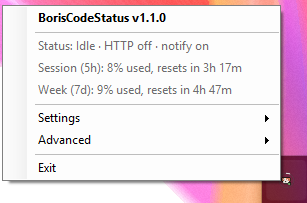
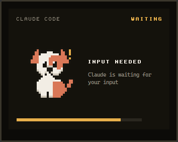

# BorisCodeStatus

<a href="https://buymeacoffee.com/andrewbadge"></a>

A small Windows tray app that shows what [Claude Code](https://docs.claude.com/en/docs/claude-code)
is doing — working, idle, or waiting for your permission — and how much of your usage quota is
left, and serves the same data over HTTP on your local network so a physical display (an
ESP32-based CrowPanel, in the setup it was built for) can show it too.

- A pixel-art dog in the tray changes pose with Claude's state; a ring around it shows the
  five-hour quota used.
- A notification card pops up when Claude is waiting on you, so a permission prompt is not missed.
- `GET /status` on port 5080 returns the whole picture as JSON for any device on the LAN — once you
  switch it on. The HTTP service is **off by default**.

<p>
  
  &nbsp;
  
</p>

It runs as a per-user tray icon — no console window, no Windows service, no administrator rights
to install.

> **Unofficial.** This is an independent community project. It is not made, endorsed or supported
> by Anthropic. See [Trademarks](#trademarks).

## Quick start

**Requirements:** Windows 10 or 11 (x64) and Claude Code. The quota figures need a Claude
subscription login — Claude Code omits `rate_limits` on API-key sessions, so those show state only.

1. Download `BorisCodeStatus-<version>.msi` from the
   [Releases](https://github.com/andrewbadge/BorisCodeStatus/releases) page and run it.
   It installs for your user only; there is no UAC prompt.
2. The tray icon appears and registers its hooks in `~/.claude/settings.json` (see
   [Hook registration](#hook-registration-first-run-logic-not-an-msi-custom-action) for exactly
   what it writes, and what it refuses to overwrite).
3. To serve `/status`, right-click the tray icon and choose **Settings → Enable HTTP service**. It is
   off by default, so a fresh install opens no port until you ask it to. See
   [The HTTP service](#the-http-service-off-by-default).
4. If you want another device to reach it, **allow the Windows Firewall prompt** that follows — this
   is the one step that needs an administrator. See [Windows Firewall](#the-one-place-admin-can-appear-windows-firewall).
5. Check it: `curl http://localhost:5080/status`.

The display firmware is a separate project and is not part of this repository. Anything that can
make an HTTP `GET` and parse JSON can consume `/status`.

## Privacy: what it reads, and what leaves your machine

Worth knowing before you install anything that hooks into Claude Code:

- **It reads** a few fields of the JSON Claude Code pipes to its hooks: model, usage percentages,
  cost, session id and name, the event name, and the text of permission prompts. Claude Code sends
  each hook its whole payload — for `UserPromptSubmit` that includes your prompt — but the hook
  deserialises only those fields and discards the rest unread. It never opens your transcripts or
  project files.
- **Out of the box it makes no network calls at all.** The only outbound call it can make is
  opt-in: with **Settings → Use usage API for Sonnet quota** ticked (off by default) and the HTTP
  service on, it **reads your Claude Code OAuth token** from `~/.claude/.credentials.json` for one
  purpose — calling `https://api.anthropic.com/api/oauth/usage`, the same account the token belongs
  to, at most once every 5 minutes, to fetch the one figure the hooks do not supply. The token is
  sent nowhere else and is never written anywhere by this app. With the setting off, the token file
  is never opened. See [data source 3](#3-apioauthusage--opt-in-fallback).
- **It serves**, once you switch the HTTP service on (it is off by default), the fields shown in
  the [`/status` sample](#the-status-endpoint) to anything on your LAN, **without
  authentication**. That includes session names and cost. Read the
  security note under [The `/status` endpoint](#the-status-endpoint) before using it on a network you do
  not trust.
- **It writes** `%LOCALAPPDATA%\BorisCodeStatus\` (state and preferences) and adds entries
  to `~/.claude/settings.json`, after backing that file up once.
- There is no telemetry, no analytics and no update check.

---

## How it works

```
 Claude Code ──stdin JSON──▶ BorisCodeStatus.Hooks.exe ──writes──▶ %LOCALAPPDATA%\BorisCodeStatus\state.json
  (statusLine +                (runs once per event,                          │
   lifecycle hooks)             then exits)                                   │ FileSystemWatcher
                                                                              ▼
                                            BorisCodeStatus.Tray.exe ── hosts ──▶ GET /status  ◀── ESP32
                                             (tray icon + in-process API)         :5080
```

There is no IPC. The short-lived hook process and the long-lived tray process share one atomically
written JSON state file; the tray watches it for changes.

---

## Data sources

Three independent sources feed the app. They are not interchangeable.

### 1. statusLine hook — usage figures (primary, no network calls)

Claude Code pipes JSON to a configured command on session events. The fields used:

| Field | Becomes |
|---|---|
| `rate_limits.five_hour.used_percentage` / `.resets_at` | `session` |
| `rate_limits.seven_day.used_percentage` / `.resets_at` | `week` |
| `cost.total_cost_usd`, `cost.total_duration_ms` | `session_cost_usd`, `session_duration_ms` |
| `context_window.used_percentage` | `context_used_percentage` |
| `model.display_name`, `session_id`, `session_name` | `model_display_name`, `session_id`, `session_name` |

Fields absent from a payload keep their previous value rather than blanking the display —
`rate_limits` is omitted entirely on API-key sessions.

### 2. Lifecycle hooks — working / idle / waiting state

statusLine carries no lifecycle signal, so the tray animation state comes from separate hooks:

| Hook | Verb argument | State |
|---|---|---|
| `Notification` (permission needed) | `notification` | `Waiting` |
| `Stop` (turn finished) | `stop` | `Idle` |
| `PreToolUse` (tool about to run) | `pretooluse` | `Working` |
| `UserPromptSubmit` | `userpromptsubmit` | `Working` |

All four invoke the same executable; the verb argument distinguishes them.

### 2b. Session hooks — is a session open at all (`session_status`)

`activity` answers a narrower question than it looks like it does. `Stop` fires the moment a turn
finishes, so a session you are actively chatting in reports `Idle` for most of its wall-clock
life — all the time spent reading a reply and typing the next prompt. A display that wants
"a session is open" rather than "Claude is generating right now" needs a second signal.

| Hook | Verb argument | Effect |
|---|---|---|
| `SessionStart` | `sessionstart` | `session_status` → `Active`, clears any previous end |
| `SessionEnd` | `sessionend` | `session_status` → `Ended` |

These deliberately leave `activity` untouched — the two signals are independent.

`session_status` is **computed per request**, not stored, because a session going quiet writes
nothing to the state file and a stored value would sit at `Active` forever:

| Value | Meaning |
|---|---|
| `Unknown` | No session event seen yet in this install |
| `Active` | An event arrived within the last 15 minutes and no `SessionEnd` followed it |
| `Inactive` | No event for over 15 minutes — inferred, this is what a session killed without firing `SessionEnd` decays into |
| `Ended` | `SessionEnd` fired; the session closed cleanly |

Any session event refreshes it — statusLine and all four lifecycle hooks, not just the session
hooks — so `Active` holds through a normal conversation. The 15-minute timeout
(`VitalsState.SessionIdleTimeout`) is deliberately generous: flapping between `Active` and
`Inactive` while the user reads a long reply would be worse than reacting slowly.

### 3. `/api/oauth/usage` — opt-in fallback

An **undocumented** Anthropic endpoint, used only for the one figure hooks cannot supply: the
Sonnet-only weekly split (`week_sonnet`).

**It is off by default.** Tick **Settings → Use usage API for Sonnet quota** to allow it. It is the
only part of the app that reads the OAuth token or talks to the network, for a figure most displays
do not show, from an endpoint that is not a contract — so it should be chosen, not assumed. The
preference is a marker file, `%LOCALAPPDATA%\BorisCodeStatus\usage-api-enabled.flag`, marking the
non-default *enabled* setting like every tray preference.

While it is off, `/status` serves `week_sonnet` and `usage_api_last_success_utc` as `null`, and
switching it off also clears any values already fetched from `state.json`. The poller and the
endpoint both read the preference each time, so toggling it needs no restart; after switching it
on, the first fetch happens at the next poll, within 10 minutes. It only ever runs while the HTTP
service is on, since `/status` is the only thing that uses the figure.

**Upgrading from 1.1 or earlier switches it off.** Earlier versions polled whenever the HTTP service
was running; tick the setting once to carry on.

It rate-limits aggressively and stays limited for an extended period once tripped, so:

- calls are floored at one per **5 minutes**, enforced across processes via a stamp file
- the background service polls no more often than every 10 minutes
- a `429` triggers an extra 30-minute back-off
- every failure is silent; the previous value simply stands

**Do not lower `UsageApiClient.MinimumInterval`.** A unit test guards it.

### No calendar-month figure

Claude Code exposes no month field anywhere, and no API endpoint provides one. `month_cost_usd` is
present in the response schema but is **always `null` in v1**. If a month figure is wanted later it
must be derived locally by summing JSONL transcript costs bucketed by month — not by inventing an
API call.

---

## Projects

| Project | Target | Role |
|---|---|---|
| `BorisCodeStatus.Core` | `net10.0` | Models, state store, settings merger, usage API client |
| `BorisCodeStatus.Core.Tests` | `net10.0-windows` | Unit tests over parsing, state, merging, throttling, dog poses, starting/stopping the listener, preferences, firewall port matching |
| `BorisCodeStatus.Hooks` | `net10.0` | Console exe Claude Code invokes; self-contained single file |
| `BorisCodeStatus.Api` | `net10.0` | Minimal API **library** — the tray hosts it in-process |
| `BorisCodeStatus.Tray` | `net10.0-windows` | WinForms tray app; the only process that actually runs |
| `BorisCodeStatus.Installer` | WiX v4 | Produces `BorisCodeStatus.msi` |

`BorisCodeStatus.Api` is a library, not an executable: the tray app starts its `WebApplication`
in-process so there is one process to install, run and tray-manage. It stays a separate project so
the endpoint can be built and tested independently of the WinForms host.

---

## The `/status` endpoint

```
GET http://<host>:5080/status
GET http://<host>:5080/health
```

Bound to `0.0.0.0` so the ESP32 can reach it across the LAN. Port is overridable with the
`BORISCODESTATUS_PORT` environment variable. CORS allows all origins.

```json
{
  "session":  { "used_percentage": 42,    "resets_at": "2026-09-13T19:00:00+00:00", "resets_in_minutes": 656 },
  "week":     { "used_percentage": 61.25, "resets_at": "2026-09-17T04:30:00+00:00", "resets_in_minutes": 5546 },
  "week_sonnet": null,
  "context_used_percentage": 37.5,
  "model_display_name": "Opus 5",
  "session_id": "abc-123",
  "session_name": "boris code status",
  "session_cost_usd": 1.2345,
  "session_duration_ms": 843000,
  "month_cost_usd": null,
  "activity": "Working",
  "activity_changed_utc": "2026-09-13T08:03:43+00:00",
  "waiting_message": null,
  "session_status": "Active",
  "last_event_utc": "2026-09-13T08:03:43+00:00",
  "session_ended_utc": null,
  "last_updated_utc": "2026-09-13T08:03:43+00:00",
  "usage_api_last_success_utc": null,
  "age_seconds": 0
}
```

`resets_in_minutes`, `age_seconds` and `session_status` are computed per request, so the firmware
does not need a clock or timezone handling. `age_seconds` lets the display grey out stale data.

`activity` is "what Claude is doing this turn"; `session_status` is "is a session open" — see
[Session hooks](#2b-session-hooks--is-a-session-open-at-all-session_status). `last_event_utc`
differs from `last_updated_utc`, which also moves for background writes such as the usage-API
refresh; only `last_event_utc` tracks actual session events.

### ⚠️ Security: the endpoint is unauthenticated

`/status` exposes session cost, usage percentages and session names to **anything on the LAN**, with
no authentication. This is a deliberate v1 decision for a home or small-office network — the ESP32
is not a browser and has nowhere to keep a credential.

Do not run this on an untrusted or shared network (a co-working space, a hotel, a guest VLAN)
without adding auth first. If you need it, the natural v1.1 is a static bearer token in a header,
checked in a one-line middleware, with the token stored next to `state.json`.

---

## Install

```
BorisCodeStatus.msi
```

**No administrator rights are required**, by design:

- per-user MSI (`Scope="perUser"`, no `ALLUSERS`) — no UAC prompt
- installs to `%LOCALAPPDATA%\Programs\BorisCodeStatus` — not `Program Files`
- starts at login via `HKCU\Software\Microsoft\Windows\CurrentVersion\Run`
- no Windows service, no scheduled task
- once the HTTP service is switched on, Kestrel binds `0.0.0.0:5080` with a plain socket, so no
  `netsh http add urlacl` reservation is needed (that is only required for http.sys / `HttpListener`)

Both executables ship self-contained, so the target machine needs no .NET runtime installed. That
is why the MSI is ~75 MB.

### The one place admin can appear: Windows Firewall

Installing needs no admin rights. **Reaching the endpoint from the ESP32 usually does**, and this
is the step most likely to catch you out. It has been hit in practice on a real install.

The first time Kestrel binds a non-loopback address — that is, the first time you enable the HTTP
service — Windows shows a firewall prompt. Approving it
requires administrator rights. If a non-admin user dismisses or cancels it — which is all they can
do — Windows does not simply skip the rule: it **creates `Block` rules** for that executable.
`/status` then still works from `localhost`, but the ESP32 is refused.

**Upgrading does not cost you this again.** Firewall rules key on the executable's *path*, not its
contents, so replacing the binary in place leaves them matching; `ShowFirstRunNoticeIfNeeded` and
the warning balloon both stop early once `Detect()` returns `Allowed`. A prompt only reappears if
the path itself changes.

`Detect()` recognises **both shapes of rule**: one naming this executable, as approving Windows'
own prompt creates, and one naming no application but opening our TCP port, as
`New-NetFirewallRule -LocalPort 5080` creates. Both genuinely allow the traffic, and treating the
second as "no rule" would send the user to a fix needing administrator rights for nothing. The
port is matched against every shape the COM API reports — `*`, a single port, a comma-separated
list, and ranges — and anything unparseable counts as *not* covering the port, so a missed rule
costs a needless warning rather than a false assurance of reachability.

Two things make this harder to diagnose than it looks:

- **Block beats Allow.** Windows Firewall evaluates `Block` rules before `Allow` rules, so adding
  an Allow rule on top of the auto-created Block rules does nothing. The Block rules must be
  removed first.
- **Testing from the machine itself proves nothing.** A request to the host's own LAN address
  (`http://192.168.x.x:5080/health` from that same machine) bypasses inbound firewall filtering and
  returns `200` even when every external device is blocked. **Only a request from another device is
  a real test.**

Check the actual state before trusting it:

```powershell
Get-NetConnectionProfile | Select-Object InterfaceAlias, NetworkCategory
Get-NetFirewallRule -Direction Inbound | Where-Object DisplayName -like "*BorisCodeStatus*" |
  Select-Object DisplayName, Action, Profile
```

The rules that apply are the ones matching the **active** `NetworkCategory`. A laptop on Wi-Fi is
frequently `Public`, not `Private`.

**None of this applies while the HTTP service is off**, which is the default. Nothing binds the
port, so Windows never prompts, the app never checks or warns, and **Fix firewall access...** is
greyed out — a rule for a port nothing is listening on would open the firewall for no reason.

**Once it is on, the app handles most of this for you.** Before it first binds the port it shows a
dialog explaining that the Windows prompt is about to appear and why "Allow access" matters. On
every start with the service on, and whenever you switch it on, it checks the firewall (reading
rules needs no elevation) and warns with a tray balloon if the display cannot reach it. The tray
menu item **Fix firewall access...** reports the current state
and offers either to run the repair elevated — surfacing the UAC prompt so an administrator can
approve it — or to copy the exact command to send to whoever administers the machine. It refuses to
open the `Public` profile unless you explicitly confirm.

The manual equivalent, for an administrator fixing it once per machine:

```powershell
# 1. Remove any Block rules left behind by a dismissed prompt
Get-NetFirewallRule -Direction Inbound -Action Block |
  Where-Object { $_.DisplayName -like "*BorisCodeStatus*" -or $_.DisplayName -like "boriscodestatus*" } |
  Remove-NetFirewallRule

# 2. Mark the network Private, if it is genuinely a home or office LAN
Set-NetConnectionProfile -InterfaceAlias "Wi-Fi" -NetworkCategory Private

# 3. Allow the relay on that profile only
New-NetFirewallRule -DisplayName "BorisCodeStatus" -Direction Inbound `
  -Program "$env:LOCALAPPDATA\Programs\BorisCodeStatus\BorisCodeStatus.Tray.exe" `
  -Protocol TCP -LocalPort 5080 -Profile Private -Action Allow
```

Prefer `-Profile Private` over `Private,Public`. `/status` is unauthenticated, so opening it on a
network Windows considers public exposes session cost and usage data to strangers. If the only way
to reach the display is to allow `Public`, add authentication first.

### Hook registration: first-run logic, not an MSI custom action

The app registers itself in `~/.claude/settings.json` **from the tray app's startup path**, not from
an installer custom action. The choice is deliberate:

- A per-user MSI custom action runs in a context where `%USERPROFILE%` is not reliably the
  installing user's — especially under deployment tooling. First-run logic always has the right user.
- The merge is idempotent, so running it on every launch also repairs a stale path after an upgrade.
  A custom action only ever runs at install time.
- A failure in a custom action fails the install. A failure at startup is recoverable and
  surfaceable through the tray's **Re-register hooks** menu item.

The MSI launches the tray app once at the end of a successful install, so registration happens
during installation from the user's point of view.

**`settings.json` is read-modify-written as a JSON tree, never regenerated.** Unrelated
configuration (permissions, theme, env, other hooks) is preserved, the original is backed up once
to `settings.json.boriscodestatus.bak`, and an unparseable file is left completely untouched.

**An existing third-party `statusLine` is never overwritten.** If one is present the app leaves it
alone and warns instead — remove the `statusLine` entry from `settings.json` by hand to switch over.
Lifecycle hooks are appended alongside any existing hooks, not replaced.

Registered entries:

```json
{
  "statusLine": {
    "type": "command",
    "command": "\"%LOCALAPPDATA%\\Programs\\BorisCodeStatus\\BorisCodeStatus.Hooks.exe\" statusline"
  },
  "hooks": {
    "Notification":     [{ "hooks": [{ "type": "command", "command": "\"...\" notification" }] }],
    "Stop":             [{ "hooks": [{ "type": "command", "command": "\"...\" stop" }] }],
    "UserPromptSubmit": [{ "hooks": [{ "type": "command", "command": "\"...\" userpromptsubmit" }] }],
    "PreToolUse":       [{ "matcher": "*", "hooks": [{ "type": "command", "command": "\"...\" pretooluse" }] }],
    "SessionStart":     [{ "hooks": [{ "type": "command", "command": "\"...\" sessionstart" }] }],
    "SessionEnd":       [{ "hooks": [{ "type": "command", "command": "\"...\" sessionend" }] }]
  }
}
```

Claude Code picked the hooks up mid-session on the install that was tested here, without a restart.
That is not documented behaviour, so if `/status` still reports `null` a minute after installing,
restart Claude Code before investigating further.

---

## Tray icon

An 8-bit dog — Fido — inside a quota ring. Drawn at runtime rather than shipped as `.ico` assets,
so it encodes live data:

| Pose | When | Accent |
|---|---|---|
| **Running**, tongue out | `activity` is `Working` | orange `#D97757` |
| **Sitting**, alert | `activity` is `Idle` | green `#6FA96A` |
| **Ears up** | `activity` is `Waiting` — a permission prompt | amber `#E8B04B` |
| **Curled up**, eyes closed | Idle for 5 minutes, or no/ended session | slate `#7A8AA3` |

The **surrounding ring** is the five-hour session quota used, turning red past 80%.

The sprites live in `DogSprites.cs` as palette-index grids, one character per pixel, transcribed
from the design's 20px sheets. Kept as data in source rather than as image files so there are no
binaries in the repo and the glyph stays diffable. 20px is the largest sprite that clears the ring
on a 32px canvas; grow either and the ring clips the ears and the accent block. Pixels are blitted
1:1 with `SetPixel` — any scaling or interpolation destroys pixel art.

### The application icon

Separate from the tray glyph, `BorisCodeStatus.Tray/fido.ico` is what Explorer, the Start Menu, Alt-Tab
and Installed Apps show. It is the one committed binary in the project: the toolchain's
`ApplicationIcon` takes a file path, not pixel data, so the `DogSprites` approach does not apply.

It packs the design's 16/20/24/32/48/64/256 sheets into one file so Windows always has an exact
size and never resamples. It uses the **orange** variant, because at this size the accent reads as
the brand colour rather than as a state. The Start Menu shortcut carries no `Icon` attribute — it
inherits the icon compiled into the executable — while `ARPPRODUCTICON` points the Installed Apps
entry at the same file.

**The dog sleeps after 5 minutes (`DogStates.SleepAfter`), but `session_status` does not report
`Inactive` until 15.** These are deliberately different clocks: the icon is ambient and can settle
after a quiet spell, while the API field is what the panel keys off and should not claim a session
is over while you are only reading a reply. A 30-second tray timer exists purely so the dog can
fall asleep — nothing writes to the state file while a session is idle, so without a clock of its
own the icon would sit awake indefinitely. It re-renders only when the pose or the quota bucket
actually changes.

The pose rule lives in `BorisCodeStatus.Core` (`DogStates.For`) rather than in the tray, so the ESP32
display can derive the same pose from the same state instead of inventing its own mapping.

Right-click menu: a **BorisCodeStatus v1.2.3** header (the build version, stamped at compile time —
clicking it opens the GitHub repository), then a status line and the current session and week
figures (display-only), then **Settings**, **Advanced** and **Exit**. The status line reads like
*Status: Idle · HTTP off · notify on* — the activity plus both settings, since neither setting is
visible anywhere else. **Settings** holds the persisted preferences — **Notify when waiting**,
**Enable HTTP service** and **Use usage API for Sonnet quota**, each ticked when on. **Advanced** holds one-off actions and repairs —
**Open in Browser** (opens `/status`), **Re-register hooks**, **Fix firewall access…** — so the
top level is only what you came to read.
Double-clicking the icon still opens `/status`, keeping a shortcut on the common action.

### Notification when Claude is waiting for you

`Waiting` is the one state that needs the user, and the easiest to miss while looking at something
else, so entering it raises a notification. It quotes the Notification hook's own text —
typically *"Claude needs your permission to use Bash"* — which is carried on `/status` as
`waiting_message` and falls back to a plain line if the hook sends none. The field is cleared on
the way out of `Waiting`, so a prompt from ten minutes ago can never be shown against a later
state.

The notification is **a card drawn by the app, not a Windows balloon** — the design's display
card: a bezel around a 320×240 screen (the ESP32 panel's size) with `CLAUDE CODE` / `WAITING`, the
full-size waiting dog with its blinking bang, a pixel-font heading and an amber bar. A balloon's
layout belongs to Windows, so none of that is possible there. Details worth knowing:

- **It never takes focus.** It is a non-activating tool window (no taskbar button), so it cannot
  swallow keystrokes meant for the terminal. Clicking it dismisses it; it cannot answer the prompt.
  `Y / N` beside the bar says what Claude is asking, not a key to press on the card.
- **The bar is a countdown** — 12 seconds, held while the pointer is over the card — and the card
  **disappears as soon as the prompt is answered**, because leaving `Waiting` dismisses it.
- **The heading is inferred from the message text** (`WaitingPrompt`): "permission" gives
  *PERMISSION NEEDED*, "waiting for your input" gives *INPUT NEEDED*, anything else *CLAUDE NEEDS
  YOU*. Those phrases are what Claude Code has been seen to send, not a documented contract, which
  is why the fallback heading is one that is true of every Notification.
- The dog is `DogSprites.WaitingPortrait`, sampled pixel-for-pixel from the design; the heading
  font is a 5×7 bitmap font kept as data in `PixelFont`. Both are drawn at a whole number of
  device pixels per design pixel, so they stay crisp at any DPI; the rest of the layout scales.
- It appears bottom-right of the **primary** monitor's working area, which is beside the tray for
  a bottom taskbar. The other tray messages (firewall, HTTP on/off, re-register) are still balloons.

It fires **on the transition only**. `Refresh` runs on every state write and every pose-timer
tick, so notifying on "is currently Waiting" would repeat the same prompt indefinitely; it is
keyed off `activity_changed_utc` instead, giving one notification per wait, while a second prompt
in the same session still gets its own because the timestamp moves.

**Settings → Notify when waiting** turns it off. It is **on by default**, which is why the marker
file records the *disabled* state (`notifications-disabled.flag`) — that way a missing or
unreadable preference gives the default, and there is no first-run write. The setting is read at
the moment of use, so it takes effect immediately rather than at the next restart, and like the
HTTP setting it survives one.

### The HTTP service (off by default)

**The HTTP service is off until you switch it on** with **Settings → Enable HTTP service**. The
endpoint is unauthenticated and serves session names and cost to the whole LAN, so a fresh install
should not open a port nobody asked for. Everything else works with it off: the tray icon, the
waiting notification, the hooks and `state.json`. Only the endpoint (and the usage-API polling
that feeds it — see below) waits for you.

Turning it off stops the listener while everything else keeps running. It releases the TCP port
rather than answering with an error status, so a client gets `ConnectionRefused` — the "relay
down" case the display already handles — instead of a 503 it would have to learn about. Verified on
both loopback and the LAN address.

**The choice survives a restart**, including the automatic one at login. It is remembered as a
marker file, `%LOCALAPPDATA%\BorisCodeStatus\http-enabled.flag`, rather than a field in
`state.json`: that file is the wire payload, rewritten constantly by the hook process, and a
preference has no business being carried in it or exposed on `/status`. As with every tray
preference, the file marks the non-default setting — here *enabled* — so a missing or unreadable
file leaves the endpoint closed. Delete it to switch the service off without the menu.

**Upgrading from an earlier version switches the service off.** Earlier versions defaulted to on
and recorded a pause as `http-paused.flag`; that file is now ignored. Enable the service once from
the menu after upgrading and it stays on.

The firewall notice described under [Windows Firewall](#the-one-place-admin-can-appear-windows-firewall)
is shown the first time you enable the service, just before it binds, and the firewall check runs
then too — neither appears while the service is off, since there is nothing to block.

Because the service's state is otherwise invisible from outside, the menu item is ticked while it
is on and the status line reads **HTTP on** or **HTTP off**. The tray tooltip leaves it out: with
the service off by default, saying so there would push out the activity and quota figures most of
the time. If the preference cannot be written, the change still takes effect and the balloon says
it will not survive a restart.

**Toggling needs no elevation.** This is a per-user app with no service and no admin rights
anywhere in its design, and gating a local toggle behind UAC would be both out of keeping and
pointless — anyone who can run the tray can also close it.

**Usage-API polling only runs while it is on** — and then only if you have also opted in to it (see
[data source 3](#3-apioauthusage--opt-in-fallback)). `UsageApiRefreshService` is a hosted service
inside the same app, so it starts and stops with the listener. That is intended: with the service
off the relay should be doing nothing at all.

Enabling after a stop builds a fresh listener — a stopped `WebApplication` cannot be restarted,
which is why `VitalsApiHost` holds the options and store rather than the app. If something else
holds the port, enabling fails with a balloon rather than silently staying down.

> **Start and Stop must never capture a `SynchronizationContext`.** Both bridge async work
> synchronously, and doing that directly on the UI thread deadlocks the tray outright: the
> framework posts its continuations back to the thread that is blocked waiting for them, and the
> shutdown timeout does not help, because cancelling does not release a continuation that can
> never be scheduled. `VitalsApiHost.RunDetached` hands the work to the thread pool to prevent it,
> and the tray additionally runs the toggle off the UI thread so the menu stays responsive.
> `DoesNotDeadlockOnAThreadWithASynchronizationContext` is the regression guard — it was confirmed
> to fail without the fix, not just pass with it.

---

## Build

Requires the .NET 10 SDK and the WiX v4 CLI:

```bash
dotnet tool install --global wix --version 4.0.5
dotnet build -c Release
```

A Release build of the solution produces `BorisCodeStatus.Installer\bin\Release\BorisCodeStatus.msi` as a
normal build output — no separate packaging step.

> **WiX version:** pinned to **4.0.5**. WiX v7 requires accepting the Open Source Maintenance Fee
> EULA, which is a commercial licensing decision rather than a technical one. v4 has no such
> requirement. Revisit only if someone signs off on the OSMF terms.

Run the tests:

```bash
dotnet test BorisCodeStatus.Core.Tests
```

### Continuous integration

`.github/workflows/build.yml` builds and tests on every push to `main` and every pull request into
`main`, and uploads the MSI as a build artifact. It never publishes a release.

Pushing repeatedly to a PR cancels the superseded run, so a burst of commits costs one build rather
than several. Runs on `main` are never cancelled, so every merged commit keeps its own result.

### Publishing a release

`.github/workflows/release.yml` is **run manually**: Actions → Release → *Run workflow*. It builds,
tests, verifies and publishes in one go, creating the tag itself so the tag and the MSI can never
disagree.

**The version is not an input.** It comes from `<Version>` in `Directory.Build.props` — the same
value stamped onto every assembly and shown in the tray menu — so a published release can never
claim a version the installed app disagrees with. To release:

1. Raise `<Version>` in `Directory.Build.props` and merge that.
2. Run the workflow.

The build takes no `-p:Version` override, so the file drives the MSI exactly as it drives a local
build; the verification step then checks that file all the way through to the MSI, rather than
checking the workflow against a value the workflow itself supplied.

| Input | Meaning |
|---|---|
| `prerelease` | Mark the GitHub Release as a pre-release |
| `force` | Publish even if the version is not higher than the latest release |

Releasing is deliberately manual rather than triggered by a tag push. Publishing under a permanent
version number is a decision, not a side effect of pushing a ref.

The version is validated before anything is built, because these failures are cheap to catch and
expensive to discover afterwards:

- **Not `major.minor.build`** — an MSI `ProductVersion` cannot carry a `-rc1` style suffix.
- **Any part above 65535** — MSI version fields are 16-bit and Windows silently truncates larger
  values, producing a package that upgrades unpredictably.
- **Tag already exists** — raise `<Version>` rather than quietly moving a published tag.
- **Not higher than the latest release** — `MajorUpgrade` will not replace an installed copy
  otherwise, so the release would install but never supersede anything. Override with `force` if
  that is genuinely intended.

The built MSI is then checked before publishing: the version was stamped, both executables are in
the payload, and `ALLUSERS` is unset — that last one is a regression guard, because setting it would
quietly turn this back into a package that demands administrator rights.

### Artifact cleanup

Each build artifact is around 78 MB, so they dominate the repository's storage quota within days.
`.github/workflows/cleanup-artifacts.yml` prunes them **daily** at 17:00 UTC — daily rather than
weekly purely because of that size, since the job itself is only a few API calls.

It deletes artifacts older than 7 days but always keeps the 3 most recent whatever their age, so
there is always something downloadable. It only ever touches workflow *artifacts*: release assets
are a separate API and are never considered, so a published release cannot be affected.

Run it by hand from the Actions tab to override the retention, or with **dry run** ticked to see
what would go without deleting anything.

Worth setting alongside it: GitHub's repository-level artifact retention (Settings → Actions →
General) defaults to 90 days. Lowering it to 7–14 days gives the same result without any workflow
running, and the two are complementary — the workflow additionally guarantees the most recent few
survive.

To build a versioned MSI locally:

```bash
dotnet build -c Release -p:Version=1.2.3
```

### Testing the hook by hand

```bash
echo '{"model":{"display_name":"Opus 5"},"rate_limits":{"five_hour":{"used_percentage":42}}}' \
  | BorisCodeStatus.Hooks.exe statusline

echo '{"hook_event_name":"Notification"}' | BorisCodeStatus.Hooks.exe notification

echo '{"hook_event_name":"SessionStart"}' | BorisCodeStatus.Hooks.exe sessionstart
echo '{"hook_event_name":"SessionEnd"}'   | BorisCodeStatus.Hooks.exe sessionend
```

Then check `%LOCALAPPDATA%\BorisCodeStatus\state.json`, or `curl http://localhost:5080/status` with the
tray running and the HTTP service enabled.

---

## Design notes

**The hook executable must be fast and must never fail.** Claude Code cancels an in-flight
statusLine script when the next event arrives, and a slow script stalls status line updates. So the
hook process does file I/O only — never network — finishes in roughly 200 ms, runs under a 3-second
watchdog, and **always exits 0**, even on malformed input or an unrecognised verb. A broken status
line is a far worse outcome than a missed update.

**It also occupies the user's statusLine slot**, so it prints a compact useful line
(`Opus 5  5h 42%  7d 61%  ctx 38%`) rather than nothing.

**State writes are atomic and cross-process safe**: serialised by a named mutex, written to a temp
file and moved into place, so a reader sees either the old file or the new one, never a partial one.
Reads share every file mode and swallow transient I/O errors.

---

## Known limitations

- **Uninstall does not remove the hook entries from `~/.claude/settings.json`.** The Run key,
  installed files and Start Menu shortcut are all removed cleanly, but the `statusLine` and `hooks`
  entries remain and will point at a missing executable. Claude Code tolerates this (the commands
  simply fail), but the entries should be removed by hand, or restored from
  `settings.json.boriscodestatus.bak`. Automating this is a v1.1 item.
- **`month_cost_usd` is always `null`.** See above — no data source provides it.
- **`week_sonnet` is `null` unless you opt in to the usage API**, and even then depends on an
  undocumented endpoint whose response shape is not contractual. The client tries several plausible
  property spellings and returns `null` rather than guessing wrong. It may simply never populate.
- **No authentication on `/status`.** See the security note above.
- **Running a development build can hijack your real `~/.claude/settings.json`.** The tray registers
  whatever path it is currently running from. If `BorisCodeStatus.Hooks.exe` happens to sit next to the
  tray exe in `bin\Debug\...` or `bin\Release\...`, that throwaway build path is written into your
  global settings — and once the directory is cleaned, every hook silently fails forever, because
  the hook process is deliberately built never to report errors. The symptom is `/status` returning
  `null` for everything with nothing logged anywhere. **This has happened in practice.** Check with:
  ```powershell
  Select-String -Path "$env:USERPROFILE\.claude\settings.json" -Pattern "BorisCodeStatus.Hooks.exe"
  ```
  If the path points inside a `bin\` folder, reinstall the MSI or use **Re-register hooks** from the
  tray menu to repoint it. A fix — refusing to register from a `bin\`/`obj\` path, and warning when
  the registered path no longer exists — is a v1.1 item.
- **The MSI has been installed and verified on a developer machine, not on a clean VM.** Confirmed
  on a real per-user install: `msiexec` exit code 0 with no UAC prompt, product registered and
  uninstallable, files in `%LOCALAPPDATA%\Programs\BorisCodeStatus`, HKCU Run key set, hooks
  re-registered to the install path automatically, and live session data served from `/status`.
  What that install did *not* cover: a machine with no prior BorisCodeStatus state, and the upgrade and
  uninstall paths. Those are still worth exercising on a fresh VM before distributing.
- **Windows only.** The tray, the installer and the firewall handling are all Windows-specific.

---

## Contributing

Issues and pull requests are welcome. Before changing behaviour, read the
[Design notes](#design-notes) and the conventions in [`CLAUDE.md`](CLAUDE.md) — several of them
(the hook process never failing, derived values computed on read, `settings.json` never being
regenerated) exist because the alternative broke something. Changes should keep this README
current in the same pull request, and `dotnet test` must pass.

By contributing you agree that your contribution is licensed under the same terms as the project.

## License

Copyright (C) 2026 Andrew Badge.

This program is free software: you can redistribute it and/or modify it under the terms of the
**GNU General Public License** as published by the Free Software Foundation, either version 3 of
the License, or (at your option) any later version. It is distributed in the hope that it will be
useful, but **without any warranty**; without even the implied warranty of merchantability or
fitness for a particular purpose. See [`LICENSE`](LICENSE) for the full text, which the installer
also places beside the executables as `LICENSE.txt`.

### Third-party components

The MSI bundles components that are not covered by this project's license:

| Component | License | Where |
|---|---|---|
| .NET runtime and ASP.NET Core | MIT | Self-contained in both executables |
| WiX Toolset v4 utility custom action (`Wix4UtilCA`) | MS-RL | Inside the MSI, used to close and launch the tray during install |

The WiX custom action runs only during installation and is not linked into the program. The test
suite additionally uses xUnit (Apache 2.0) and coverlet (MIT) at build time; neither ships.

## Trademarks

"Claude" and "Claude Code" are trademarks of Anthropic, PBC. They are used here only to say which
tool this project works with. This project is not affiliated with, endorsed by or sponsored by
Anthropic, and it relies on an undocumented Anthropic endpoint that may change or stop working at
any time.
