

# BorisCodeStatus

**A Windows tray app — and a LAN endpoint for a desk display — that shows what Claude Code is doing and how much quota is left.**

[Features](#features) ·
[Quick start](#quick-start) ·
[Privacy](docs/privacy.md) ·
[How it works](docs/how-it-works.md) ·
[Data sources](docs/how-it-works.md#data-sources) ·
[Projects](docs/how-it-works.md#projects) ·
[The `/status` endpoint](docs/status-endpoint.md) ·
[Install](docs/install.md) ·
[Tray icon](docs/tray.md) ·
[HTTP service](docs/tray.md#the-http-service-off-by-default) ·
[Build](docs/development.md) ·
[Design notes](docs/development.md#design-notes) ·
[Spec](docs/SPECS.md) ·
[Known limitations](docs/known-limitations.md) ·
[Contributing](CONTRIBUTING.md) ·
[License](docs/license.md) ·
[Trademarks](docs/license.md#trademarks)

---

A small Windows tray app that shows what [Claude Code](https://docs.claude.com/en/docs/claude-code)
is doing — working, idle, or waiting for your permission — and how much of your usage quota is
left, and serves the same data over HTTP on your local network so a physical display (an
ESP32-based CrowPanel, in the setup it was built for) can show it too.

- A pixel-art dog — or cat, sentry bot, rubber duck or goat — in the tray shows Claude's state; a ring behind it shows the
  five-hour quota used, green, then amber, then red.
- A notification card (and, if you like, a bark, a purr, a chirp or a quack) when Claude is waiting on you, so a
  permission prompt is not missed.
- A status card you can pin on screen, full size or mini.
- `GET /status` on port 5080 returns the whole picture as JSON for any device on the LAN — once you
  switch it on. The HTTP service is **off by default**.

### Features

<!-- An HTML table rather than Markdown: GitHub sizes Markdown table columns by their text, which
     shrank the images in one column and not the other. Fixed halves keep every card one size and
     every settings shot another. -->
<table>
<tr>
<td width="50%" valign="top">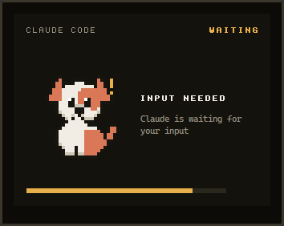 <b>Waiting card.</b> Pops up when Claude needs you, quoting what it is asking for. A countdown bar, held while you hover; it vanishes once the prompt is answered. Never steals focus from the terminal.</td>
<td width="50%" valign="top">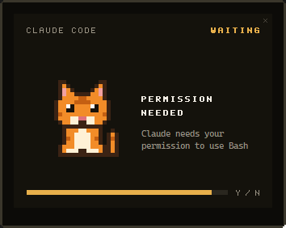 <b>Pick a pet.</b> <i>Who keeps you company?</i> — pick the cat, a sentry bot, a rubber duck or a goat and it replaces Fido in the tray, on the waiting card and on the status card.</td>
</tr>
<tr>
<td width="50%" valign="top">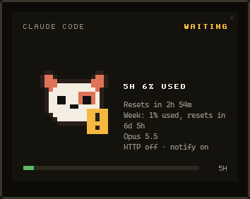 <b>Status card.</b> Double-click the tray icon for the current state, the 5-hour and weekly figures, the model, and the session gauge in its quota colour.</td>
<td width="50%" valign="top">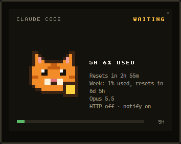 <b>Keep it on screen.</b> Pin the status card and it stays on top and updates live. Drag it anywhere; it returns to the same spot next time, pulled back on screen if your monitors change.</td>
</tr>
<tr>
<td width="50%" valign="top">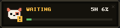 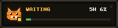 <b>Mini status card.</b> A strip a fifth the height: pose, state, the 5-hour figure and the gauge. Every card has a faint close button that brightens on hover.</td>
<td width="50%" valign="top">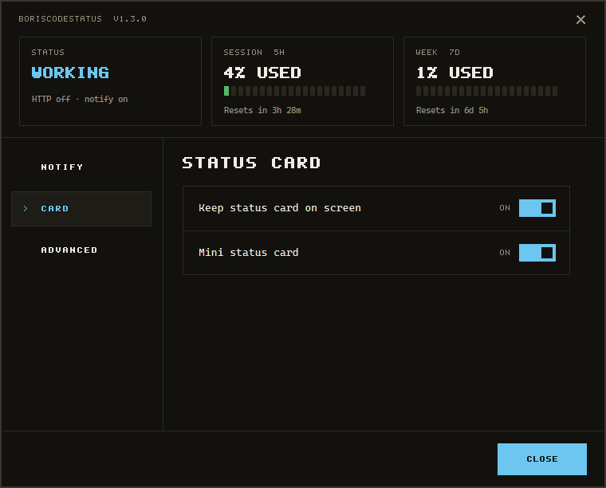 <b>Settings window.</b> Right-click the icon → <i>Settings…</i>. Live status, session and week tiles over the Notify, Card and Advanced pages.</td>
</tr>
<tr>
<td width="50%" valign="top">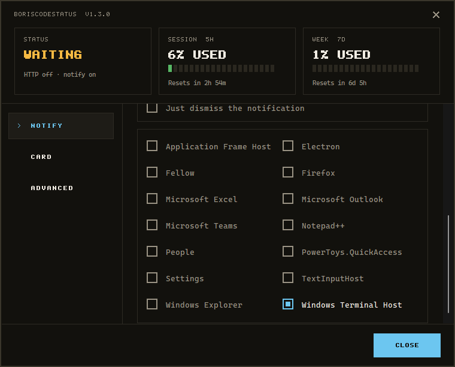 <b>Jump to your terminal.</b> Choose an app — your terminal, a browser, anything open — and clicking the waiting card, double-clicking the icon or double-clicking the pinned card brings it to the front. Off by default.</td>
<td width="50%" valign="top">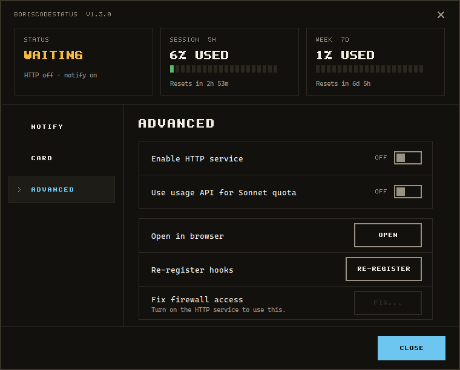 <b>Advanced.</b> The HTTP service, the usage-API fallback, and the repairs: open <code>/status</code>, re-register hooks, fix firewall access.</td>
</tr>
<tr>
<td width="50%" valign="top">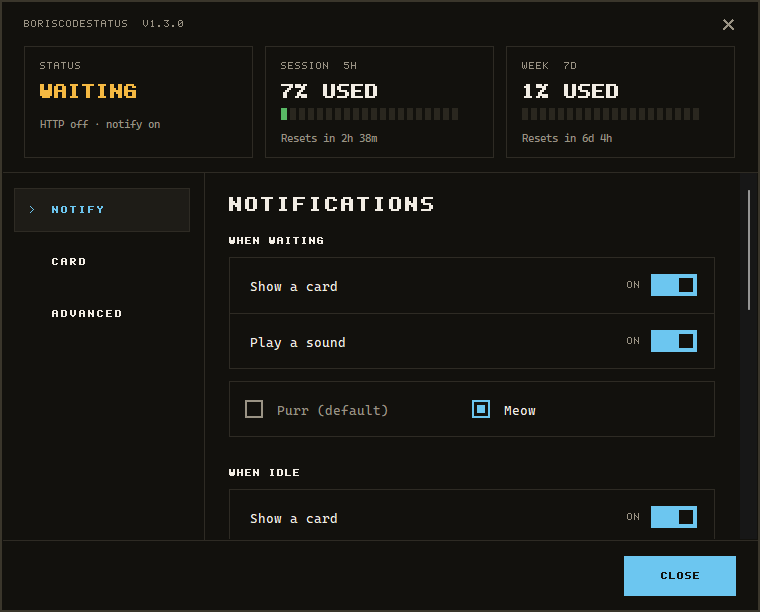 <b>When waiting.</b> When Claude needs you — a permission prompt or a question — show a card, play a sound, or both. The dog pants or woofs; the cat purrs or meows; the bot chirps or clamps; the duck quacks or flies away; the goat bleats or calls the herd. The card is on by default; the sound is off.</td>
<td width="50%" valign="top">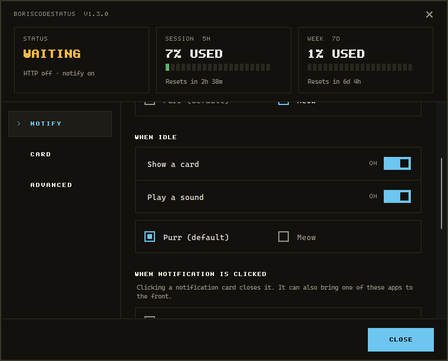 <b>When idle.</b> The same choices for when Claude finishes its turn: a <i>YOUR TURN</i> card, a sound, or both, with its own choice of sound. Off by default.</td>
</tr>
<tr>
<td colspan="2" valign="top"><b>Errors are logged.</b> Anything unexpected, from the tray or the hook, goes to <code>%LOCALAPPDATA%\BorisCodeStatus\error.log</code> instead of a crash dialog.</td>
</tr>
</table>

It runs as a per-user tray icon — no console window, no Windows service, no administrator rights
to install.

> **Unofficial.** This is an independent community project. It is not made, endorsed or supported
> by Anthropic. See [Trademarks](docs/license.md#trademarks).

### Why Boris?

Boris is a spoodle — the dog of the project's author, [Andrew Badge](https://github.com/andrewbadge).
He is the pixel-art dog in the tray: working when Claude is working, waiting when it needs you,
and asleep when nothing is happening.

## Quick start

**Requirements:** Windows 10 or 11 (x64) and Claude Code. The quota figures need a Claude
subscription login — Claude Code omits `rate_limits` on API-key sessions, so those show state only.

1. Download `BorisCodeStatus-<version>.msi` from the
   [Releases](https://github.com/andrewbadge/BorisCodeStatus/releases) page and run it.
   It installs for your user only; there is no UAC prompt.
2. The tray icon appears and registers its hooks in `~/.claude/settings.json` (see
   [Hook registration](docs/install.md#hook-registration-first-run-logic-not-an-msi-custom-action) for exactly
   what it writes, and what it refuses to overwrite).
3. To serve `/status`, right-click the tray icon, choose **Settings…**, and switch on **Advanced → Enable HTTP service**. It is
   off by default, so a fresh install opens no port until you ask it to. See
   [The HTTP service](docs/tray.md#the-http-service-off-by-default).
4. If you want another device to reach it, **allow the Windows Firewall prompt** that follows — this
   is the one step that needs an administrator. See [Windows Firewall](docs/install.md#the-one-place-admin-can-appear-windows-firewall).
5. Check it: `curl http://localhost:5080/status`.

The display firmware is a separate project and is not part of this repository. Anything that can
make an HTTP `GET` and parse JSON can consume `/status`.

## Documentation

| Page | What it covers |
|---|---|
| [Privacy](docs/privacy.md) | What the app reads, what it stores and serves, and the one outbound call it can make |
| [How it works](docs/how-it-works.md) | The hook and tray processes, the data sources behind each figure, and projects |
| [The `/status` endpoint](docs/status-endpoint.md) | The JSON payload, field by field, and why the endpoint is unauthenticated |
| [Install](docs/install.md) | The per-user MSI, Windows Firewall, and how the hooks are registered |
| [Tray icon](docs/tray.md) | The icon, the pets, the cards, notifications and sounds, and the HTTP service |
| [Development](docs/development.md) | Building, CI, dependency updates, publishing a release, testing hooks, design notes |
| [Spec](docs/SPECS.md) | The behaviour spec |
| [Known limitations](docs/known-limitations.md) | What it cannot do, and why |
| [License](docs/license.md) | GPL-3.0-or-later, third-party components, trademarks |

Contributions are welcome — see [`CONTRIBUTING.md`](CONTRIBUTING.md), the
[Code of Conduct](CODE_OF_CONDUCT.md) and the [security policy](SECURITY.md).
