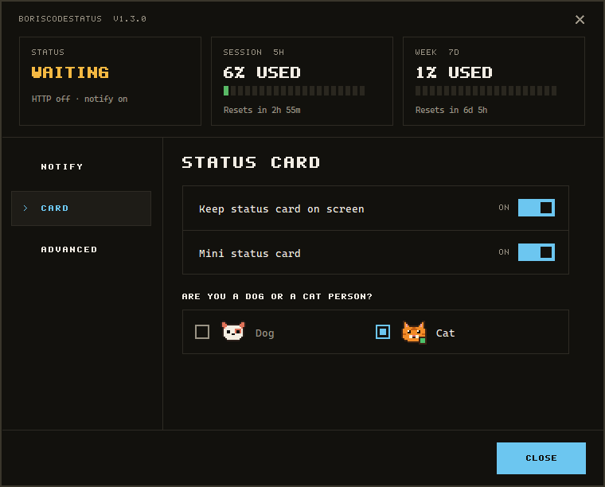

# Tray icon

[← Back to the README](../README.md)

An 8-bit dog — Fido — over a quota ring. Drawn at runtime rather than shipped as `.ico` assets,
so it encodes live data:

| Pose | When | Accent |
|---|---|---|
| Blue square badge | `activity` is `Working` | blue `#6CC6F0` |
| No badge, plain face | `activity` is `Idle` | — |
| Amber **!** badge | `activity` is `Waiting` — a permission prompt | amber `#F5B942` |
| Eyes shut, **Z** badge | Idle for 5 minutes, or no/ended session | lavender `#C8C8D7` |

The **ring behind the dog** is the five-hour session quota used: green below 50%, amber from 50% to
75%, red above 75%.

The sprites live in `DogSprites.cs` as palette-index grids, one character per pixel, transcribed
from the design's 16px tray icons. Kept as data in source rather than as image files so there are no
binaries in the repo and the glyph stays diffable. The icon is drawn at the tray's real
small-icon size so Windows never resamples it, and the dog fills it like any other tray icon; the
ring sits behind and shows in the gaps. The design's 32px and 64px icons are exactly the 16px one
doubled and quadrupled, so larger sizes are whole-pixel integer scales — any interpolation
destroys pixel art. At 125%/150% scaling the dog stays 16px with a margin.

### Pick a pet

**Settings → Card → Who keeps you company?** swaps Fido for an orange cat, a sentry bot, a rubber
duck or a goat everywhere the tray draws one: the tray icon, the waiting card (each has its own portrait in
place of the dog's — the bot waves, the duck holds up a "!" sign) and the status card. The goat is the one pet that moves: while Claude is working or waiting its mouth is open and its
tongue wags, swinging between two frames every 250ms on the tray icon and on every card. Idle it
closes its mouth and holds still, as it does asleep. The choice is
stored by name in `pet.txt`; the dog is the default, so it is the file's absence. Versions before the
bot and duck marked the cat with `cat-person.flag`, which is still read when `pet.txt` is missing so
an upgrade keeps the cat. The bot's eye and antenna and the duck's badge show the pose; neither
design has a sleeping pose, so each sleeps as its idle face with the eye off or shut. The cat's
sprites live in `DogSprites.cs` beside the dog's, on their own palette, transcribed from the
design's sheets the same way. Two notes: the cat's idle face carries a green badge where the
dog's has none, as drawn; and the design's sleeping cat is curled up and too wide for 16px, so
it appears on the full status card while the tray uses a 16px sleeping face derived from the idle
one. The choice is the tray's alone — `/status` and the pose rule are unchanged, so the ESP32
display keeps its own art. The application icon stays the dog.

### The application icon

Separate from the tray glyph, `BorisCodeStatus.Tray/fido.ico` is what Explorer, the Start Menu, Alt-Tab
and Installed Apps show. It is one of only two kinds of committed binary in the project — the other is the waiting
sounds — because the toolchain's `ApplicationIcon` takes a file path, not pixel data, so the
`DogSprites` approach does not apply.

It packs the design's 16/24/32/48/64/256 icons into one file so Windows always has an exact
size and never resamples. It uses the badge-less **idle** face, because a state badge means nothing
on a static icon. The Start Menu shortcut carries no `Icon` attribute — it
inherits the icon compiled into the executable — while `ARPPRODUCTICON` points the Installed Apps
entry at the same file.

**The dog sleeps after 5 minutes (`DogStates.SleepAfter`), but `session_status` does not report
`Inactive` until 15.** These are deliberately different clocks: the icon is ambient and can settle
after a quiet spell, while the API field is what the panel keys off and should not claim a session
is over while you are only reading a reply. A 30-second tray timer exists purely so the dog can
fall asleep — nothing writes to the state file while a session is idle, so without a clock of its
own the icon would sit awake indefinitely. It re-renders only when the pose or the quota bucket
actually changes.

The pose rule lives in `BorisCodeStatus.Core` (`DogStates.For`) rather than in the tray, so the ESP32
display can derive the same pose from the same state instead of inventing its own mapping.

**Right-click menu:** a **BorisCodeStatus v1.2.3** header (the build version, stamped at compile
time — clicking it opens the GitHub repository), **Settings…** and **Exit**. Kept short so it opens
instantly; everything else is in the settings window.

**The settings window** repeats the version header and adds three tiles: **Status** (the dog's pose in its badge colour, plus whether
HTTP and notifications are on, since neither is visible anywhere else), **Session · 5h** and
**Week · 7d**, each with its figure, a twenty-segment gauge in the ring's colours and the reset time.
They update live while the window is open. Below, three pages: **Notify** — for *When waiting* and *When idle*, a card, a sound and which sound,
and the app a click on a card brings forward; **Card** — *Keep status card on screen*
and *Mini status card*, and *Who keeps you company?*; **Advanced** — *Enable HTTP service*, *Use usage API for Sonnet quota*, and
the repairs: **Open in browser** (opens `/status`), **Re-register hooks** and **Fix firewall
access…**, greyed out while the HTTP service is off. **Close** sits at the bottom;
Esc closes too, and the strip above the tiles drags the window.
**Double-clicking the icon** brings the app chosen under **When notification is clicked** to the
front, if one is chosen; otherwise it **shows the status card** — the same display card as the waiting
notification, with the dog in its current pose, the 5-hour figure and reset time, the week, the
model and both settings, over a bar that is the session gauge in its green/amber/red. It is a
snapshot, hides itself after 12 seconds (or on a click), and needs no HTTP service. `/status` is
still under **Settings → Advanced → Open in browser**.

**Settings → Card → Keep status card on screen** (off by default, `status-card-pinned.flag`) pins it
instead: it stays up, always on top, and updates live with every state change. Drag it anywhere —
the whole card is the handle, and it still never takes focus from the terminal. Double-click it to bring the
chosen app to the front. Where you leave it
is saved to `status-card-position.txt` and restored at the next start, pulled fully back onto the
nearest monitor's working area if that spot is no longer on screen — a monitor unplugged, the
layout rearranged, the resolution lowered. Untick the setting to put it away.

**Settings → Card → Mini status card** (off by default, `status-card-mini.flag`) shrinks it to a strip
two-thirds the width and a fifth the height: the dog in its current pose, the state, the 5-hour
figure and the gauge, without the detail lines. It applies to both the double-click snapshot and
the pinned card, and switching it while the card is up redraws it in place.

Every card has a faint **×** in its top-right corner that brightens under the pointer. It only
closes the card — on the waiting card it does not bring the chosen app forward — and on a pinned
status card it also unticks **Keep status card on screen**, since otherwise the next refresh would
bring it straight back.

### Notification when Claude is waiting for you

`Waiting` is the one state that needs the user, and the easiest to miss while looking at something
else, so entering it raises a notification. It quotes the Notification hook's own text —
typically *"Claude needs your permission to use Bash"* — which is carried on `/status` as
`waiting_message` and falls back to a plain line if the hook sends none. The field is cleared on
the way out of `Waiting`, so a prompt from ten minutes ago can never be shown against a later
state.

The notification is **a card drawn by the app, not a Windows balloon** — the design's display
card: a bezel around a 320×240 screen (the ESP32 panel's size) with `CLAUDE CODE` / `WAITING`, the
full-size waiting dog with its blinking bang, a pixel-font heading and an amber bar. A balloon's
layout belongs to Windows, so none of that is possible there. Details worth knowing:

- **It never takes focus.** It is a non-activating tool window (no taskbar button), so it cannot
  swallow keystrokes meant for the terminal. Clicking it dismisses it; it cannot answer the prompt.
  **Settings → Notify → When notification is clicked** can also make the click bring an app to the front —
  your terminal, a browser, anything with a window open. It is **off by default** (*Just
  dismiss*). The page lists the apps open at that moment; the choice is stored as a process
  name in `card-click-app.txt`, so it still works after the app restarts. With several windows of
  that app open, the one whose title looks like Claude Code's — a status glyph and a space before
  the topic, such as `✳ Fix the login bug` — comes forward, so Visual Studio's debug console beside
  it is skipped. That title format is observed, not documented; with no match, the front-most
  window of the app wins. It brings the window forward, not the tab within it.
  `Y / N` beside the bar says what Claude is asking, not a key to press on the card.
- **The bar is a countdown** — 12 seconds, held while the pointer is over the card — and the card
  **disappears as soon as the prompt is answered**, because leaving `Waiting` dismisses it.
- **The heading is inferred from the message text** (`WaitingPrompt`): "permission" gives
  *PERMISSION NEEDED*, "waiting for your input" gives *INPUT NEEDED*, anything else *CLAUDE NEEDS
  YOU*. Those phrases are what Claude Code has been seen to send, not a documented contract, which
  is why the fallback heading is one that is true of every Notification.
- The dog is `DogSprites.WaitingPortrait`, sampled pixel-for-pixel from the design; the heading
  font is a 5×7 bitmap font kept as data in `PixelFont`. Both are drawn at a whole number of
  device pixels per design pixel, so they stay crisp at any DPI; the rest of the layout scales.
- It appears bottom-right of the **primary** monitor's working area, which is beside the tray for
  a bottom taskbar. The other tray messages (firewall, HTTP on/off, re-register) are still balloons.

It fires **on the transition only**. `Refresh` runs on every state write and every pose-timer
tick, so notifying on "is currently Waiting" would repeat the same prompt indefinitely; it is
keyed off `activity_changed_utc` instead, giving one notification per wait, while a second prompt
in the same session still gets its own because the timestamp moves.

**Settings → Notify → When waiting → Show a card** turns it off. It is **on by default**, which is why the marker
file records the *disabled* state (`notifications-disabled.flag`) — that way a missing or
unreadable preference gives the default, and there is no first-run write. The setting is read at
the moment of use, so it takes effect immediately rather than at the next restart, and like the
HTTP setting it survives one.

**Each moment has its own card and its own sound.** The Notify page has two sections, **When
waiting** (a permission prompt or question) and **When idle** (Claude has finished its turn), each
with *Show a card*, *Play a sound*, and which sound — all independent, so any mix of card, sound,
both or neither works for each.

- **Defaults:** only the waiting card is on. The waiting sound, the idle card and the idle sound
  are off (`waiting-sound.flag`, `idle-card.flag`, `idle-sound.flag` mark them on) — a turn ends
  far more often than a prompt appears, and an unasked-for sound is the most intrusive thing the
  app could do.
- **The idle card** reads *YOUR TURN* with the pet in its idle pose and a green countdown, and comes
  down as soon as the next turn starts. A click on it behaves like a click on the waiting card. It
  fires on the same once-per-transition rule, and a session that is already idle when the tray
  starts is not announced.
- **The sounds follow the pet:** the dog **pants** by default and can **woof** instead; the cat
  **purrs** by default and can **meow** — chosen separately for each moment and each pet
  (`dog-woof.flag`, `cat-meow.flag`, `idle-dog-woof.flag`, `idle-cat-meow.flag`, and
  `bot-alternate.flag`, `duck-alternate.flag`, `goat-alternate.flag` and their `idle-` twins), so
  switching pets keeps every choice. Picking a sound, or switching one on, plays it. The bot
  **chirps** by default and can **clamp**; the duck **quacks** by default and can **fly away** (8
  seconds); the goat **bleats** by default and can call **the herd** — the longest sound at 10
  seconds. A long sound is cut short by the next sound to play.
- The recordings are by [freesound_community](https://pixabay.com/users/freesound_community-46691455/)
  on Pixabay, used under the [Pixabay Content License](https://pixabay.com/service/license-summary/)
  rather than this project's licence (see [Third-party components](license.md#third-party-components)). They are 16-bit PCM
  WAV, embedded in the tray assembly (`BorisCodeStatus.Tray/Sounds`), because the built-in
  `SoundPlayer` plays only WAV and an embedded resource needs nothing from the installer.

### The HTTP service (off by default)

**The HTTP service is off until you switch it on** with **Settings → Advanced → Enable HTTP service**. The
endpoint is unauthenticated and serves session names and cost to the whole LAN, so a fresh install
should not open a port nobody asked for. Everything else works with it off: the tray icon, the
waiting notification, the hooks and `state.json`. Only the endpoint (and the usage-API polling
that feeds it — see below) waits for you.

Turning it off stops the listener while everything else keeps running. It releases the TCP port
rather than answering with an error status, so a client gets `ConnectionRefused` — the "relay
down" case the display already handles — instead of a 503 it would have to learn about. Verified on
both loopback and the LAN address.

**The choice survives a restart**, including the automatic one at login. It is remembered as a
marker file, `%LOCALAPPDATA%\BorisCodeStatus\http-enabled.flag`, rather than a field in
`state.json`: that file is the wire payload, rewritten constantly by the hook process, and a
preference has no business being carried in it or exposed on `/status`. As with every tray
preference, the file marks the non-default setting — here *enabled* — so a missing or unreadable
file leaves the endpoint closed. Delete it to switch the service off without the menu.

**Upgrading from an earlier version switches the service off.** Earlier versions defaulted to on
and recorded a pause as `http-paused.flag`; that file is now ignored. Enable the service once from
the menu after upgrading and it stays on.

The firewall notice described under [Windows Firewall](install.md#the-one-place-admin-can-appear-windows-firewall)
is shown the first time you enable the service, just before it binds, and the firewall check runs
then too — neither appears while the service is off, since there is nothing to block.

Because the service's state is otherwise invisible from outside, the menu item is ticked while it
is on and the status line reads **HTTP on** or **HTTP off**. The tray tooltip leaves it out: with
the service off by default, saying so there would push out the activity and quota figures most of
the time. If the preference cannot be written, the change still takes effect and the balloon says
it will not survive a restart.

**Toggling needs no elevation.** This is a per-user app with no service and no admin rights
anywhere in its design, and gating a local toggle behind UAC would be both out of keeping and
pointless — anyone who can run the tray can also close it.

**Usage-API polling only runs while it is on** — and then only if you have also opted in to it (see
[data source 3](how-it-works.md#3-apioauthusage--opt-in-fallback)). `UsageApiRefreshService` is a hosted service
inside the same app, so it starts and stops with the listener. That is intended: with the service
off the relay should be doing nothing at all.

Enabling after a stop builds a fresh listener — a stopped `WebApplication` cannot be restarted,
which is why `VitalsApiHost` holds the options and store rather than the app. If something else
holds the port, enabling fails with a balloon rather than silently staying down.

> **Start and Stop must never capture a `SynchronizationContext`.** Both bridge async work
> synchronously, and doing that directly on the UI thread deadlocks the tray outright: the
> framework posts its continuations back to the thread that is blocked waiting for them, and the
> shutdown timeout does not help, because cancelling does not release a continuation that can
> never be scheduled. `VitalsApiHost.RunDetached` hands the work to the thread pool to prevent it,
> and the tray additionally runs the toggle off the UI thread so the menu stays responsive.
> `DoesNotDeadlockOnAThreadWithASynchronizationContext` is the regression guard — it was confirmed
> to fail without the fix, not just pass with it.
